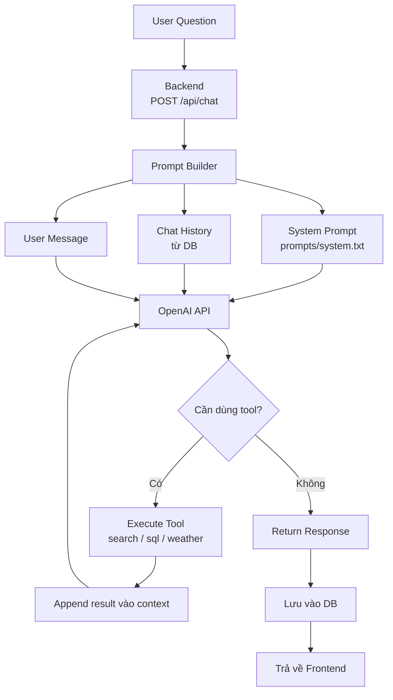
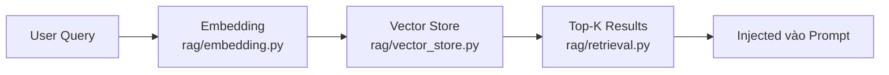
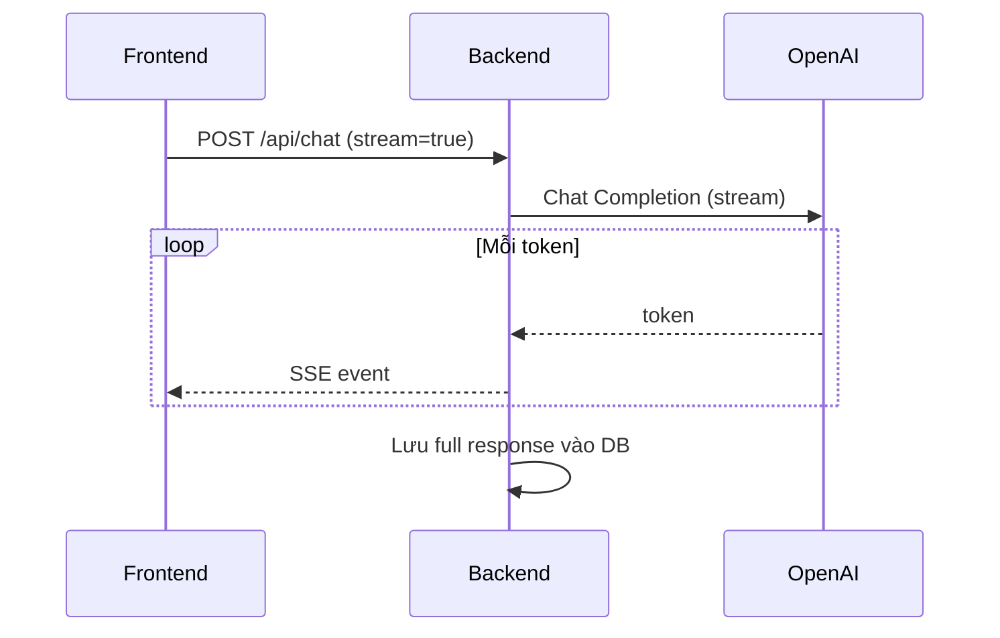

# Thiết kế AI Service

## AI Flow



## Components

### LLM (`llm.py`)

```python
# Supported providers
- OpenAI (GPT-4, GPT-3.5-turbo)
- Anthropic (Claude)
- Local (Ollama)
```

### Prompt Builder

**System Prompt** (`prompts/system.txt`)
- Vai trò: Trợ lý tài chính FinCalc
- Ngôn ngữ: Tiếng Việt
- Phạm vi: Tiết kiệm, đầu tư, vay, phân tích tài chính

**User Prompt**
```
{system_prompt}

---Lịch sử---
{chat_history}

---Câu hỏi hiện tại---
{user_message}
```

### Tools

| Tool | File | Mô tả | Khi nào dùng |
|------|------|-------|---------------|
| Search | `tools/search.py` | Tìm kiếm web | Câu hỏi về tin tức tài chính |
| SQL | `tools/sql.py` | Query database | Câu hỏi về số liệu cá nhân |
| Weather | `tools/weather.py` | Thời tiết | Phân tích ngành du lịch/nông nghiệp |

### RAG (Retrieval-Augmented Generation)



- **Embedding**: sentence-transformers hoặc OpenAI embeddings
- **Vector Store**: ChromaDB / Pinecone / pgvector
- **Use case**: Tìm kiếm document tài chính, FAQ

## Cấu hình

```env
# .env
AI_PROVIDER=openai          # openai | anthropic | ollama
AI_MODEL=gpt-4              # model name
OPENAI_API_KEY=sk-...       # API key
RAG_ENABLED=false           # bật/tắt RAG
EMBEDDING_MODEL=all-MiniLM-L6-v2
```

## Streaming (tương lai)


