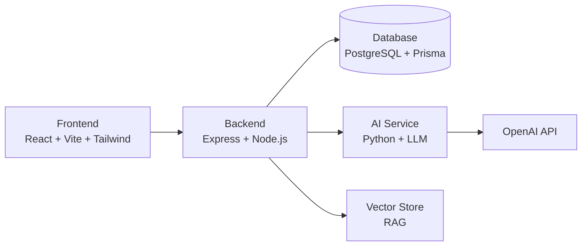
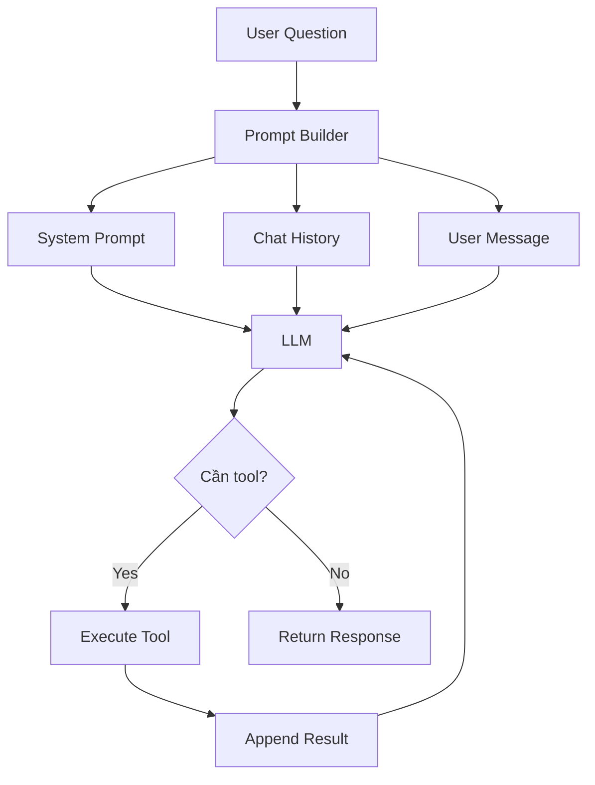
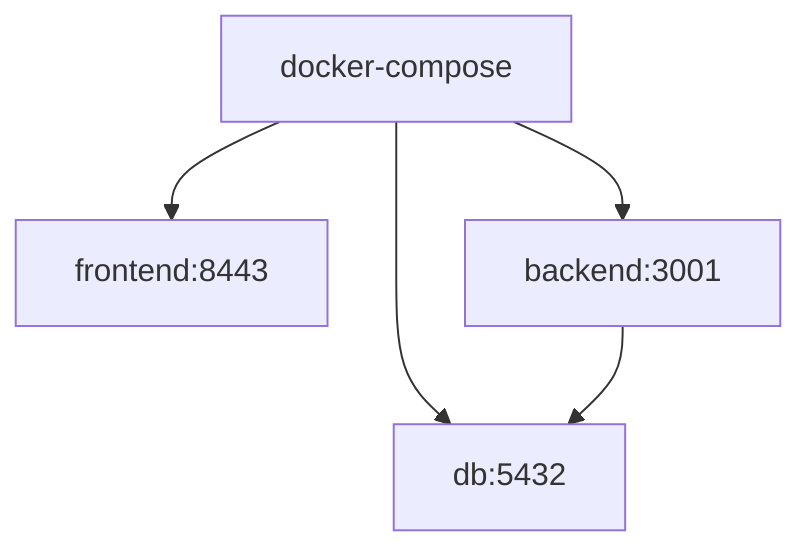

# Kiến trúc hệ thống FinCalc

## Tổng quan

## Frontend

- **Framework**: React 19 + TypeScript
- **Styling**: Tailwind CSS v4
- **Bundler**: Vite
- **State**: React hooks (useState, useCallback, useMemo)
- **Routing**: Client-side state (page switching)
- **Port**: 8443

## Backend

- **Runtime**: Node.js
- **Framework**: Express
- **Port**: 3001

### Routes
| Method | Endpoint | Mô tả |
|--------|----------|-------|
| GET | /api/health | Kiểm tra trạng thái |
| POST | /api/auth/login | Đăng nhập |
| POST | /api/auth/register | Đăng ký |
| GET | /api/users/me | Thông tin người dùng |
| PUT | /api/users/me | Cập nhật hồ sơ |
| GET | /api/transactions | Danh sách giao dịch |
| POST | /api/transactions | Tạo giao dịch mới |
| POST | /api/chat | Gửi tin nhắn AI |
| GET | /api/chat/:id/history | Lịch sử chat |

## Database

- **Engine**: PostgreSQL 16
- **ORM**: Prisma
- **Port**: 5432

## AI Service

- **Language**: Python
- **LLM**: OpenAI GPT-4 (tùy chọn)
- **RAG**: Vector embedding + similarity search
- **Tools**: Weather, SQL, Web Search (mở rộng)

## Docker

