# Thiết kế Database

## ER Diagram

```mermaid
erDiagram
    USERS ||--o{ TRANSACTIONS : has
    USERS ||--o{ CHAT_HISTORY : has
    USERS ||--o{ CONVERSATIONS : has
    CONVERSATIONS ||--o{ MESSAGES : has

    USERS {
        uuid id PK
        varchar name
        varchar email UK
        varchar password_hash
        text avatar_url
        varchar theme
        boolean show_balance_default
        timestamp created_at
        timestamp updated_at
    }

    TRANSACTIONS {
        uuid id PK
        uuid user_id FK
        varchar type
        bigint amount
        text description
        varchar quarter
        varchar status
        timestamp created_at
    }

    CONVERSATIONS {
        uuid id PK
        uuid user_id FK
        varchar title
        timestamp created_at
    }

    MESSAGES {
        uuid id PK
        uuid conversation_id FK
        varchar role
        text content
        timestamp created_at
    }

    CHAT_HISTORY {
        uuid id PK
        uuid user_id FK
        varchar role
        text content
        timestamp created_at
    }
```



## Tables

### users

| Field | Type | Constraint | Mô tả |
|-------|------|------------|-------|
| id | UUID | PK, DEFAULT gen_random_uuid() | ID người dùng |
| name | VARCHAR(255) | NOT NULL | Họ và tên |
| email | VARCHAR(255) | UNIQUE, NOT NULL | Email |
| password_hash | VARCHAR(255) | NOT NULL | Mật khẩu (bcrypt) |
| avatar_url | TEXT | NULL | URL ảnh đại diện |
| theme | VARCHAR(20) | DEFAULT 'light' | Giao diện (light/dark/system) |
| show_balance_default | BOOLEAN | DEFAULT false | Ẩn số dư mặc định |
| created_at | TIMESTAMPTZ | DEFAULT NOW() | Ngày tạo |
| updated_at | TIMESTAMPTZ | DEFAULT NOW() | Ngày cập nhật |

### transactions

| Field | Type | Constraint | Mô tả |
|-------|------|------------|-------|
| id | UUID | PK | ID giao dịch |
| user_id | UUID | FK → users.id, ON DELETE CASCADE | Người dùng |
| type | VARCHAR(20) | CHECK (deposit/withdraw) | Loại giao dịch |
| amount | BIGINT | NOT NULL | Số tiền (VND, đơn vị: đồng) |
| description | TEXT | NULL | Mô tả |
| quarter | VARCHAR(10) | NULL | Quý (Q1-2026) |
| status | VARCHAR(20) | DEFAULT 'completed' | Trạng thái |
| created_at | TIMESTAMPTZ | DEFAULT NOW() | Ngày tạo |

### conversations

| Field | Type | Constraint | Mô tả |
|-------|------|------------|-------|
| id | UUID | PK | ID cuộc trò chuyện |
| user_id | UUID | FK → users.id | Người dùng |
| title | VARCHAR(255) | NULL | Tiêu đề |
| created_at | TIMESTAMPTZ | DEFAULT NOW() | Ngày tạo |

### messages

| Field | Type | Constraint | Mô tả |
|-------|------|------------|-------|
| id | UUID | PK | ID tin nhắn |
| conversation_id | UUID | FK → conversations.id | Cuộc trò chuyện |
| role | VARCHAR(20) | NOT NULL | assistant / user |
| content | TEXT | NOT NULL | Nội dung |
| created_at | TIMESTAMPTZ | DEFAULT NOW() | Ngày tạo |

### chat_history

| Field | Type | Constraint | Mô tả |
|-------|------|------------|-------|
| id | UUID | PK | ID |
| user_id | UUID | FK → users.id | Người dùng |
| role | VARCHAR(20) | NOT NULL | assistant / user |
| content | TEXT | NOT NULL | Nội dung |
| created_at | TIMESTAMPTZ | DEFAULT NOW() | Ngày tạo |

## Indexes

```sql
CREATE INDEX idx_transactions_user_id ON transactions(user_id);
CREATE INDEX idx_transactions_created_at ON transactions(created_at DESC);
CREATE INDEX idx_messages_conversation_id ON messages(conversation_id);
CREATE INDEX idx_chat_history_user_id ON chat_history(user_id);
```
